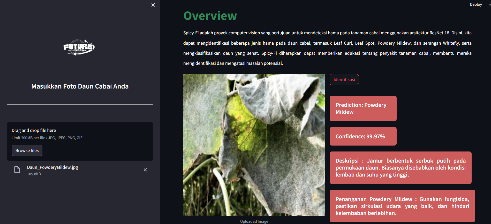

# Spicy-fi : Identification of Pests on Chili Plants  Using Leaf Image Analysis

## Project Description

Spicy-Fi merupakan sebuah proyek computer vision yang bertujuan untuk mendeteksi hama pada tanaman cabai dengan memanfaatkan arsitektur ResNet-18. Melalui proyek ini, kami dapat mengidentifikasi beberapa jenis hama yang mungkin menyerang daun cabai, antara lain Leaf Curl, Leaf Spot, Powdery Mildew, dan serangan Whitefly, sekaligus melakukan klasifikasi terhadap daun yang masih dalam kondisi sehat. Tujuan utama Spicy-Fi adalah memberikan kontribusi pada edukasi mengenai penyakit-penyakit yang dapat menyerang tanaman cabai, sekaligus membantu para petani dalam mengidentifikasi dan mengatasi potensi masalah pada tanaman mereka.

## Layer 1


## Layer 2


## Layer 3


## Contributor
| Full Name | Affiliation | Email | LinkedIn | Role |
| --- | --- | --- | --- | --- |
| Fitria Yuliska | STIE Pembangunan Tanjungpinang | fitriayuliskaa@gmail.com | [link](https://id.linkedin.com/in/fitriayuliska) | Team Lead |
| Farhan Yehanda | Universitas Sumatera Utara | farhanyehanda19@gmail.com  | [link](https://id.linkedin.com/in/farhan-yehanda-b90936242) | Team Member |
| Fathi Muthia Tarie | Universitas Gunadarma | fathimtari55@gmail.com | [link](https://id.linkedin.com/in/fathi-muthia-tarie-31b73821a) |Team Member |
| Muhammad Nurur Raudhan | St Ilmu Komputer Cipta Karya Informatika | didanggc@gmail.com | [link](https://id.linkedin.com/in/muhammad-nurur-raudhan-5441051b8) | Team Member  |
| Rizki Ramadhan | Universitas Muhammadiyah Prof Dr Hamka | rizki.ramadhan2511@gmail.com  | [link](https://id.linkedin.com/in/rizki-ramadhan-56b4a524a)   |Team Member |
| Zahra Izzah Rahmadina | Institut Teknologi Telkom Purwokerto | zahraizzah9@gmail.com | [link](https://id.linkedin.com/in/zahra-izzah-rahmadina-611a16279) | Team Member  |
| Putu Rika Sahriana | Startup Campus, AI Track | rikasahriana28@gmail.com | [link](https://id.linkedin.com/in/rikasahriana) | Supervisor |

## Setup
### Prerequisite Packages (Dependencies)
- pandas==1.5.3
- openai==0.28.0
- torch==2.1.0
- torchvision==0.16.0
- numpy==1.23.5
- scikit-learn==1.2.2
- Pillow==9.4.0

### Environment
| | |
| --- | --- |
| CPU | AMD Ryzen 5 5500U with Radeon Graphics |
| GPU | AMD Radeon(TM) Graphics |
| ROM | 512 GB SSD |
| RAM | 8 GB |
| OS | HP Laptop 14s-fq1xxx |

## Dataset
Kami menggunakan dataset dari Roboflow yang berjudul "Chili Leaves Disease Classification Image Dataset" link. Dataset ini telah di-latih sebelumnya dan terdiri dari enam kelas, dengan satu kelas sehat dan lima kelas penyakit:

- # Healthy
  
  
- # Leaf Curl
  
- # Leaf Spot
  
- # Powdery Mildew
  
- # White Fly
  
- # Yellowish
  

Untuk melakukan analisis lebih mendalam, kami memutuskan untuk menyusun ulang dataset dengan 340 foto untuk setiap kelas. Kami juga melakukan pembersihan data pada class Healthy karena menghadapi kendala seperti kurangnya variasi data dan kualitas foto yang buruk. Sebagai solusi, kami mengganti 90 data pada kelas ini.

- [Link Dataset](https://drive.google.com/drive/folders/1tJawaIQh5ybeObUrO3vGiC09w20WqLFZ?usp=sharing)

## Results
### Model Performance


#### 1. Metrics
Evaluasi model menunjukkan hasil yang memuaskan dalam mengklasifikasikan jenis hama pada tanaman cabai. Akurasi model mencapai [nilai akurasi], precision sekitar [nilai precision], dan recall sekitar [nilai recall]. Hasil ini menunjukkan bahwa model memiliki kemampuan untuk memberikan prediksi positif dengan akurasi yang baik, dan mampu mengenali sebagian besar kasus positif secara keseluruhan. Dengan demikian, model dapat dianggap sebagai alat yang efektif dalam membantu petani mengidentifikasi dan menangani masalah kesehatan tanaman pada daun cabai.


| model | epoch | learning_rate | batch_size | optimizer | val_loss | val_precision | val_recall |
| --- | --- | --- | --- | --- | --- | --- | --- |
| CNN | 300 |  0.001 | 16 | SGD | 0.492 | 85.3% | 85.3% |
| Resnet-18 | 300 | 0.001 | 16 | SGD | 0.207 | 95.6% | 95.4% |
| --- | --- | --- | --- | --- | --- | --- | --- |


#### 2. Ablation Study
Mengubah jumlah Blok Residual dengan yang sebelumnya berjumlah 18 menjadi hanya 6 Blok Residual. Selanjutnya adalah penambahan dropout layer dengan rincian sebagai berikut:

| model | Dropout Layer | accuracy | accuracy |
| --- | --- | --- | --- | 
| Resnet-18 | 0.3 | 77.43% | 95.636% |
| Resnet-18 | 0.5 | 72.11% | 88.7% |
| ... | ... | ... | ... | 

#### 3. Training/Validation Curve

 
### Testing
Show some implementations (demos) of this model. Show **at least 10 images** of how your model performs on the testing data.





### Deployment (Optional)
Untuk deployment kami masih menggunakan localhost atau local deployment, untuk menjalankan programnya menggunakan Anaconda dengan python 3.10.9

## Supporting Documents
### Presentation Deck
- Link: https://www.canva.com/design/DAF00MVwUr4/2CtAGTCa3qhdhsgdDiS-zg/edit?utm_content=DAF00MVwUr4&utm_campaign=designshare&utm_medium=link2&utm_source=sharebutton

### Business Model Canvas


### Short Video
Provide a link to your short video, that should includes the project background and how it works.
- Link: https://drive.google.com/file/d/1GFQStmsHwORjFFlCbDiurTe1nhuGVADa/view?usp=sharing

## References
Provide all links that support this final project, i.e., papers, GitHub repositories, websites, etc.
- Link: https://github.com/NishaniKasineshan/DeepLearning-Projects/blob/main/Image_classification_using_Resnet18.ipynb
- Link: https://www.researchgate.net/publication/353803706_Klasifikasi_citra_makanannon_makanan_menggunakan_metode_Transfer_Learning_dengan_model_Residual_Network

How to Cite
If you find this project useful, we'd grateful if you cite this repository:

```
@article{
...
}
```

## License
For academic and non-commercial use only.

## Acknowledgement
This project entitled <b>"Spicy-Fi :  Identification of Pests on Chili Plants Using Leaf Image Analysis"</b> is supported and funded by Startup Campus Indonesia and Indonesian Ministry of Education and Culture through the "**Kampus Merdeka: Magang dan Studi Independen Bersertifikasi (MSIB)**" program.
